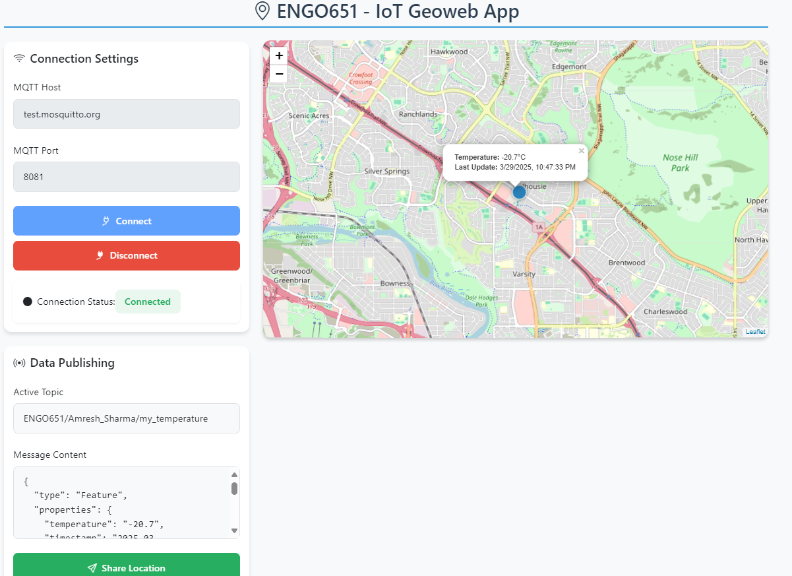

# ENGO651 - IoT Geoweb Application

A real-time geolocation tracking system that transforms smartphones into IoT sensors using MQTT and Leaflet.js.



## Table of Contents
- [Features](#features)
- [Technologies Used](#technologies-used)
- [Installation](#installation)
- [Usage](#usage)
- [Configuration](#configuration)
- [Testing with MQTTX](#testing-with-mqttx)
- [Mobile Deployment](#mobile-deployment)
- [License](#license)

## Features

- **Real-time Geolocation Sharing**: Publish device location via MQTT
- **Temperature Simulation**: Generate random temperature values (-40°C to 60°C)
- **Interactive Visualization**:
  - Color-coded map markers (Blue <10°C, Green <30°C, Red ≥30°C)
  - Detailed popups with temperature and timestamp
- **MQTT Integration**:
  - Connect to any MQTT broker
  - Automatic reconnection
  - Secure WebSocket support
- **Responsive UI**: Mobile-friendly Bootstrap interface
- **Debugging Tools**: Message payload inspection

## Technologies Used

- **Frontend**: 
  - Leaflet.js (Mapping)
  - Bootstrap 5 (UI)
  - Paho MQTT (Client)
- **Backend**: 
  - MQTT Broker (test.mosquitto.org)
- **Protocols**: 
  - MQTT over WebSockets
  - Geolocation API

## Installation

1. Clone the repository:
```bash
git clone https://github.com/yourusername/engo651-lab5.git
cd engo651-lab5
```

2. Serve the application using any web server. For Python 3:
```bash
python3 -m http.server 8000
```

3. Open in browser:
```
http://localhost:8000
```

## Usage

1. **Connection Setup**
   - Default Broker: `test.mosquitto.org:8081`
   - Click "Start Connection"

2. **Publish Location Data**
   - Click "Share My Status"
   - Allow browser location access
   - Watch real-time updates on map

3. **Monitor Data**
   - Interactive map shows current location
   - Click markers for temperature details
   - View raw JSON payload in textarea

4. **Disconnection**
   - Click "End Connection" to stop

## Configuration

Modify in code:
```javascript
// Change these constants
const courseCode = "ENGO651";
const studentName = "Amresh_Sharma"; // Use underscores for spaces

// Broker configuration
const host = "test.mosquitto.org";
const port = 8081; // 8080 for non-SSL
```

## Testing with MQTTX

1. **Subscribe to Messages**
   ```
   Host: test.mosquitto.org
   Port: 1883
   Topic: ENGO651/Amresh_Sharma/my_temperature
   ```

2. **Sample Publish Message**
```json
{
  "type": "Feature",
  "properties": {
    "temperature": 22.5,
    "timestamp": "2023-10-16T09:30:00Z"
  },
  "geometry": {
    "type": "Point",
    "coordinates": [-114.0719, 51.0447]
  }
}
```

## Mobile Deployment

1. **Requirements**
   - Modern browser (Chrome/Edge recommended)
   - Enabled location services
   - HTTPS connection (for geolocation)

2. **Best Practices**
   - Use GitHub Pages for hosting
   - Enable "Desktop Site" in mobile browser
   - Allow persistent location permissions